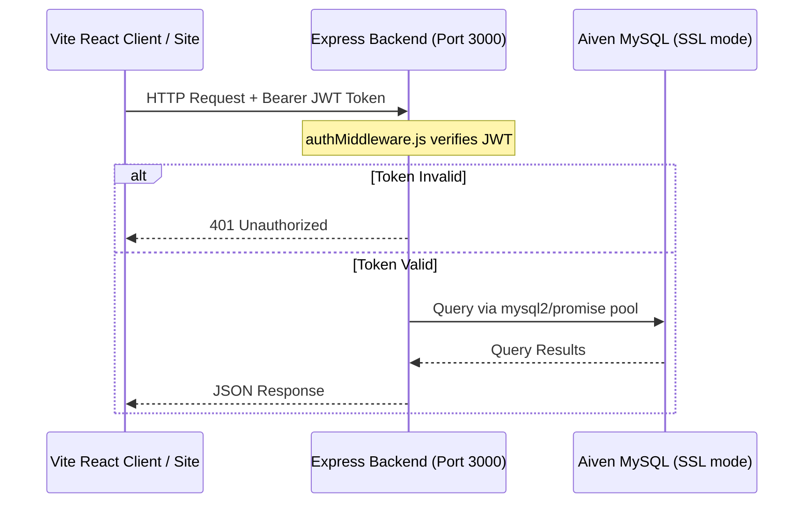
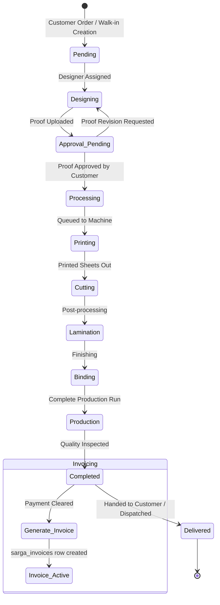
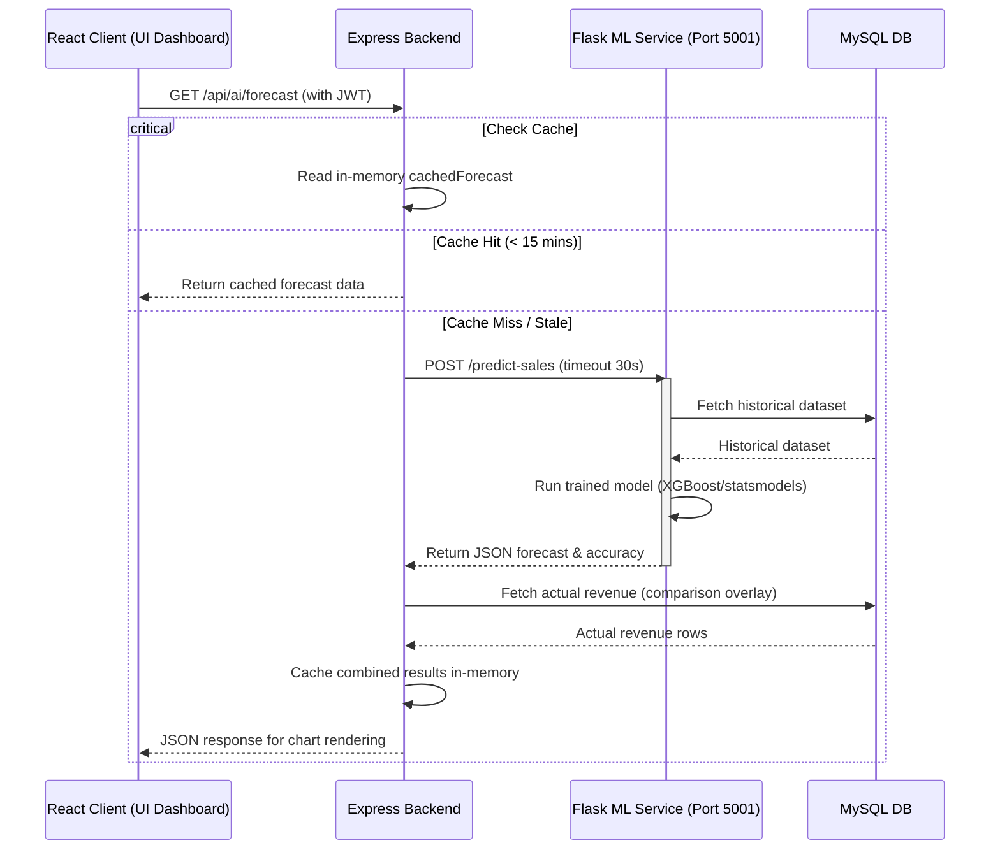
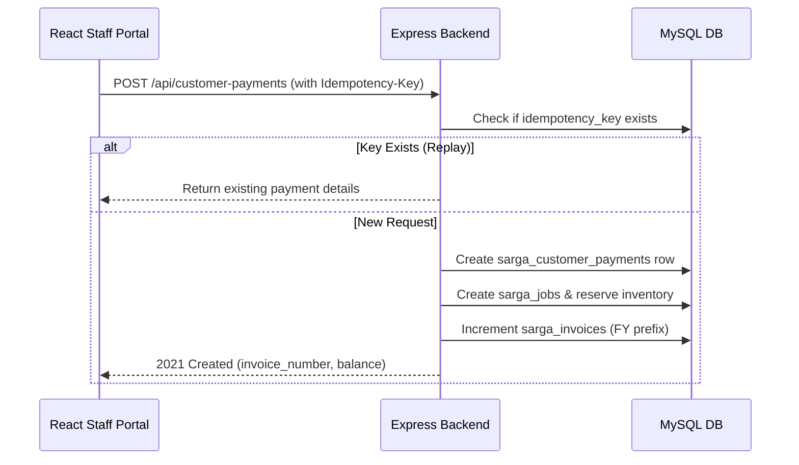
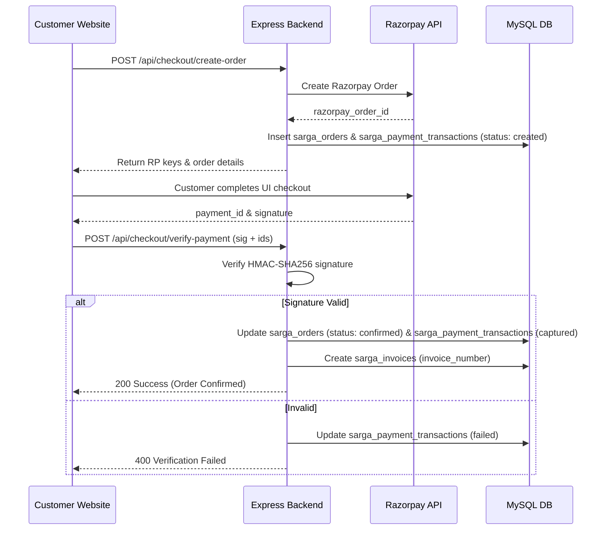
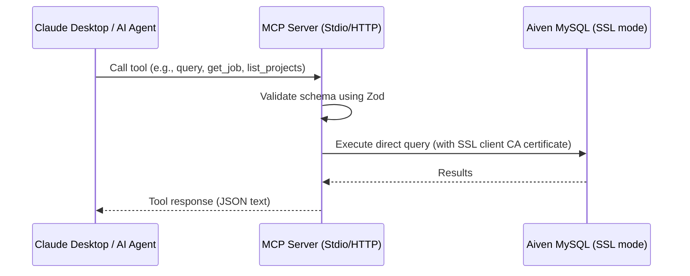
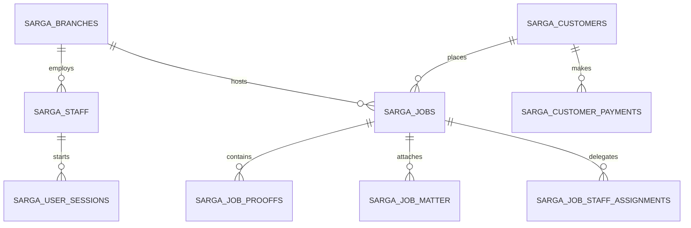
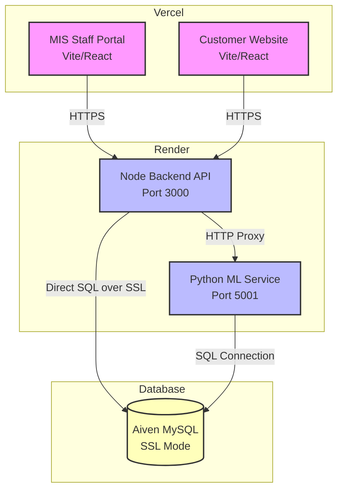

# Sarga Prints MIS — System Architecture

This document describes the actual, current software architecture of the Sarga Prints Management Information System (MIS). Every detail documented here has been directly extracted from the codebase.

## 1. System Overview
The Sarga Prints MIS is a print-shop management system designed to coordinate business and production activities between the customer-facing branch in **Perambra** and the offset production branch in **Meppayur**[^server/schemas/003_paper.sql]. The system is structured as a monorepo consisting of a React/Vite staff portal frontend, an Express.js Node.js backend, a customer-facing public website, an AI/ML Flask microservice for predictive analytics, and a Model Context Protocol (MCP) server that exposes database actions to AI agents like Claude Desktop.

---

## 2. Component Map

| Component | Purpose & Responsibilities | Tech Stack & Key Dependencies | Entry Point(s) | Deployment & Live URL |
| :--- | :--- | :--- | :--- | :--- |
| **Client** (`/client`) | Staff & admin management portal for print jobs, customer records, inventory, payments, attendance, and branch statistics. | React (v19.2.0), Vite (v6.0.11), Vanilla CSS (design token design system), React Router DOM (v7.13.0), Axios, Lucide React, Recharts (v3.8.1), TanStack React Query (v5.101.0). [^client/package.json] | [main.jsx](file:///d:/software%20sarga/client/src/main.jsx) | Vercel<br>[software-sarga.vercel.app](https://software-sarga.vercel.app) [^render.yaml] |
| **Server** (`/server`) | Central backend API serving the client and customer website; coordinates DB migrations, JWT auth, cron jobs, and SNMP printer integration. | Node.js, Express (v5.2.1), MySQL (`mysql2/promise` v3.16.3), JWT (`jsonwebtoken`), Cloudinary (v2.10.0), net-snmp (v3.26.1), pdfkit (v0.17.2). [^server/package.json] | [index.js](file:///d:/software%20sarga/server/index.js) | Render (Web Service)<br>[software-sarga-2.onrender.com/api](https://software-sarga-2.onrender.com/api) [^render.yaml] |
| **Website** (`/website`) | Public portal for customers to place orders, upload artwork, track job status, review designer proofs, and interact with a chatbot. | React (v19.2.0), Vite (v6.0.11), Axios, Fabric.js (v7.4.0), html2canvas, jsPDF (v4.2.1), React Router DOM. [^website/package.json] | [main.jsx](file:///d:/software%20sarga/website/src/main.jsx) | Vercel<br>[sargaoffset.vercel.app](https://sargaoffset.vercel.app) [^server/index.js] |
| **ML Service** (`/ml-service`) | Python service performing predictive analysis, fraud logs auditing, expense categorization, sales and turnaround time prediction. | Python, Flask (v3.0.0), XGBoost (v2.0.3), scikit-learn (v1.4.0), pandas, TensorFlow (v2.15.0), PaddleOCR (v2.7.0.3). [^ml-service/requirements.txt] | [app.py](file:///d:/software%20sarga/ml-service/app.py) | Render (Web Service)<br>[sarga-ml-service.onrender.com](https://sarga-ml-service.onrender.com) [^render.yaml] |
| **MCP Server** (`/mcp-server`) | Exposes databases and backend actions as MCP tools to AI assistants (e.g. Claude Desktop) for system inspection. | Node.js, TypeScript (v5.7.0), `@modelcontextprotocol/sdk` (v1.12.1), `mysql2/promise` (v3.16.3), Zod (v3.23.8). [^mcp-server/package.json] | [index.ts](file:///d:/software%20sarga/mcp-server/src/index.ts) (STDIO)<br>[http-server.ts](file:///d:/software%20sarga/mcp-server/src/http-server.ts) (HTTP) | Local / Developer Environment (via STDIO) |

---

## 3. Data Flow Diagrams

### 3.1 Request Flow (Client/Website → Server → MySQL)
All data-fetching and write operations flow through the Express.js gateway, which validates JWT tokens and queries the MySQL instance:



### 3.2 Job Lifecycle (Order Creation → Production → Completion → Billing)
Jobs pass through a multi-stage status tracker as they transition from layout to final delivery and invoicing:



### 3.3 ML Microservice Call Flow
AI predictions and insights are requested by the client, proxied by the backend, and answered by the Python service:



### 3.4 Payment Flows

#### Walk-in & Manual Payment Flow (Admin/Staff)


#### Public Web Checkout Flow (Razorpay)


#### ⚠️ Flagged Integration: GPay Business Webhook
> [!WARNING]
> **Component Absence Alert**: The payment flow `GPay Business notification → Notification Bridge APK → webhook → server` described in system proposals is **not found** in the active codebase. No Android APK, notification listening service, or GPay notification webhook endpoint exists in the monorepo files. Payment processing is strictly manual (recorded by staff) or via Razorpay for the public website.

---

### 3.5 MCP Tool Call Flow
AI agents (e.g. Claude Desktop) query the database directly through the MCP Server interface:



---

## 4. Database

### 4.1 Logical Database Table Groupings
The database contains a mixture of core tables populated by SQL schemas[^server/schemas/] and dynamic tables initialized in code.



#### Core Business Entities
- `sarga_branches`: Core branches (Perambra, Meppayur)[^server/schemas/001_core.sql]
- `sarga_staff`: Staff metadata, roles, salaries, and login user_ids[^server/schemas/001_core.sql]
- `sarga_job_seq`: Track unique daily sequence numbers per branch[^server/schemas/001_core.sql]

#### Inventory & Papers
- `sarga_inventory`: Retail/consumable products, cost/sell price, stock count[^server/schemas/002_inventory.sql]
- `sarga_stock_requests`: Branch-to-branch stock transfers and approvals[^server/schemas/002_inventory.sql]
- `sarga_branch_stock`: Quantities of inventory items per branch[^server/schemas/002_inventory.sql]
- `sarga_inventory_consumption`: Logs of consumables used[^server/schemas/002_inventory.sql]
- `sarga_inventory_reorders`: Record history of restock requests[^server/schemas/002_inventory.sql]
- `sarga_stock_verifications`: Monthly audit headers[^server/schemas/002_inventory.sql]
- `sarga_stock_verification_items`: Differences between system & physical counts[^server/schemas/002_inventory.sql]
- `sarga_purchase_orders` & `sarga_purchase_order_items`: Vendor procurement orders[^server/schemas/002_inventory.sql]
- `sarga_paper_inventory`: Reams/sheets and sizes of paper stock per branch[^server/schemas/003_paper.sql]
- `sarga_paper_adjustments`: Log manual sheets modifications[^server/schemas/003_paper.sql]
- `paper_types`: Active sizes and GSM categories[^server/schemas/003_paper.sql]
- `paper_stock_movements` & `paper_stock_summary`: Live tracking of sheets per branch[^server/schemas/003_paper.sql]
- `consumables_inventory` & `consumables_inventory_adjustments`: Inks/plate chemicals[^server/schemas/003_paper.sql]
- `sarga_paper_cut_map`: Parent sheet to child cut sizes mapping ratio[^server/schemas/003_paper.sql]

#### Job & Production System
- `sarga_jobs`: Master table tracking status, pricing, dimensions, and payments[^server/schemas/006_jobs.sql]
- `sarga_job_matter`: Design assets and original artwork file uploads[^server/schemas/006_jobs.sql]
- `sarga_job_staff_assignments`: Delegates tasks to specific designers/printers[^server/schemas/006_jobs.sql]
- `sarga_job_status_history`: Timestamped state tracker for job lifecycle monitoring[^server/schemas/006_jobs.sql]
- `sarga_paper_usage_logs`: Logs sheets/waste consumed during printing phases[^server/schemas/006_jobs.sql]
- `sarga_job_proofs`: Customer-facing proofs, review status, and feedback[^server/schemas/006_jobs.sql]

#### Customers & Web Interactions
- `sarga_customers`: Customer list, mobile index, type (Walk-in, Retail, Offset)[^server/schemas/004_customers.sql]
- `sarga_customer_designs`: Customer asset library for designs and logos[^server/schemas/004_customers.sql]
- `sarga_business_profiles`: B2B profile data and credit limits[^server/schemas/016_phase1_commerce.sql]
- `sarga_brand_assets`: Logos, custom fonts, color schemes for B2B portal[^server/schemas/016_phase1_commerce.sql]
- `sarga_orders`: Checkout orders from customer portal[^server/schemas/016_phase1_commerce.sql]
- `sarga_carts` & `sarga_cart_items`: Cart persistence on website[^server/schemas/016_phase1_commerce.sql]
- `sarga_reviews`: Public Google Reviews cache[^server/schemas/016_phase1_commerce.sql]
- `express_production_rules`: Product lead times (3hr, 24hr)[^server/schemas/016_phase1_commerce.sql]
- `sarga_delivery_tracking`: Shipping status for courier dispatches[^server/schemas/016_phase1_commerce.sql]
- `sarga_staff_leaves`: Leave requests filed by employees[^server/schemas/staff_portal.sql]
- `sarga_tasks`: Task checklist entries assigned to staff[^server/schemas/staff_portal.sql]

#### Finance & Expenses
- `sarga_vendors`: Utility, supply, and rental suppliers[^server/schemas/007_vendors.sql]
- `sarga_vendor_bills` & `sarga_vendor_bill_items`: Details of supply bills[^server/schemas/007_vendors.sql]
- `sarga_vendor_payments`: Log payout transactions[^server/schemas/007_vendors.sql]
- `sarga_utility_connections` & `sarga_utility_bills`: Electric, water, internet meters[^server/schemas/007_vendors.sql]
- `sarga_payments`: Central ledger for outbound payouts (rent, salary, utility, vendors)[^server/schemas/007_vendors.sql]
- `sarga_payment_methods`: Active payment methods (Cash, UPI, Cheque, Bank Transfer)[^server/schemas/007_vendors.sql]
- `sarga_payment_suggestions`: Logs recurring vendor names to recommend profiles[^server/schemas/007_vendors.sql]
- `sarga_customer_payments`: Ledger for customer advances and final payments[^server/schemas/004_customers.sql]
- `sarga_customer_requests`: Edits/deletion approval requests[^server/schemas/004_customers.sql]
- `sarga_coupons`: Active discount coupon rules[^server/schemas/004_customers.sql]
- `sarga_discount_requests`: Staff requests for approval on high discount margins[^server/schemas/004_customers.sql]
- `sarga_rent_locations`: Monthly shop rent trackers[^server/schemas/008_finance.sql]
- `sarga_emi_master` & `sarga_emi_payments`: Equipment and vehicle EMI logs[^server/schemas/008_finance.sql]
- `sarga_kuri_master` & `sarga_kuri_payments`: Local financial chit (Kuri) systems[^server/schemas/008_finance.sql]
- `sarga_office_expenses`, `sarga_transport_expenses`, `sarga_misc_expenses`: Logged operational expenditures[^server/schemas/008_finance.sql]
- `sarga_petty_cash`: Log of cash-box movements[^server/schemas/008_finance.sql]
- `sarga_bills_documents`: Inbound bills PDFs and links[^server/schemas/008_finance.sql]
- `sarga_invoice_sequence`: Sequence counter for invoices[^server/schemas/008_finance.sql]
- `sarga_invoices`: Track generated tax invoices[^server/schemas/008_finance.sql]
- `sarga_payment_transactions`: Razorpay payment statuses[^server/schemas/016_phase1_commerce.sql]

#### Audit, AI & Security
- `sarga_audit_logs`: Audit trailing for employee actions[^server/schemas/011_audit_ai.sql]
- `sarga_alerts`: System alert flags[^server/schemas/011_audit_ai.sql]
- `sarga_id_requests`: Requests to change staff user ID[^server/schemas/011_audit_ai.sql]
- `sarga_staff_activity_log`: Detailed staff request footprints[^server/schemas/011_audit_ai.sql]
- `sarga_fraud_alerts`: Suspicious transactions/actions logged by anomaly engine[^server/schemas/011_audit_ai.sql]
- `sarga_design_checks`: Preflight analysis of design sizes/elements[^server/schemas/011_audit_ai.sql]
- `sarga_ai_cache`: Caches responses from AI LLM operations[^server/schemas/011_audit_ai.sql]
- `sarga_expense_training`: User feedback to retrain ML expense classifier[^server/schemas/011_audit_ai.sql]
- `sarga_user_sessions`: Login session tokens and expiry flags[^server/schemas/sessions.sql]
- `sarga_security_audit`: Security violations/failures[^server/schemas/sessions.sql]

---

### 4.2 Tables Initialized dynamically (Missing from `/server/schemas/`)
Several tables are not declared in the static migration `.sql` scripts but are instead created lazily in code (via `CREATE TABLE IF NOT EXISTS`) during runtime execution:

| Table Name | File Declaring / Creating | Purpose |
| :--- | :--- | :--- |
| `sarga_quotes` | [quotes.js](file:///d:/software%20sarga/server/routes/quotes.js#L13) | Stores customer price quotes |
| `sarga_quote_items` | [quotes.js](file:///d:/software%20sarga/server/routes/quotes.js#L41) | Stores line items within quotes |
| `sarga_product_image_requests` | [products.js](file:///d:/software%20sarga/server/routes/products.js#L46) | Stores requests to change product preview images |
| `sarga_product_links` | [products.js](file:///d:/software%20sarga/server/routes/products.js#L66) | Maps inventory items to subcategory services |
| `sarga_product_update_requests` | [products.js](file:///d:/software%20sarga/server/routes/products.js#L80) | Staff changes awaiting admin review |
| `sarga_password_reset_tokens` | [passwordReset.js](file:///d:/software%20sarga/server/routes/passwordReset.js#L21) | Handles temporary self-serve password reset keys |
| `sarga_invoice_tracking` | [invoiceFeatures.js](file:///d:/software%20sarga/server/routes/invoiceFeatures.js#L14) | Tracks invoice state (draft, finalized) |
| `sarga_recurring_invoices` | [invoiceFeatures.js](file:///d:/software%20sarga/server/routes/invoiceFeatures.js#L38) | Schedule templates for B2B monthly invoices |
| `sarga_payment_modes` | [invoiceFeatures.js](file:///d:/software%20sarga/server/routes/invoiceFeatures.js#L63) | Extra parameters for ledger payment methods |
| `sarga_tax_settings` | [invoiceFeatures.js](file:///d:/software%20sarga/server/routes/invoiceFeatures.js#L76) | Global CGST/SGST configuration variables |
| `sarga_company_settings` | [invoiceFeatures.js](file:///d:/software%20sarga/server/routes/invoiceFeatures.js#L90) | Address & bank details printed on PDF invoices |
| `sarga_i18n_overrides` | [invoiceFeatures.js](file:///d:/software%20sarga/server/routes/invoiceFeatures.js#L100) | Customer translation maps for receipts |
| `sarga_customer_otps` | [website.js](file:///d:/software%20sarga/server/routes/website.js#L387) | Stores email verification hash codes |
| `sarga_website_chat_messages` | [chatStore.js](file:///d:/software%20sarga/server/services/chatStore.js#L18) | Persistent logs of website bot chats |
| `sarga_staff_behavior_profile` | [anomalyDetection.js](file:///d:/software%20sarga/server/helpers/anomalyDetection.js#L38) | Baselines for login hours and action frequencies |
| `sarga_inventory_to_paper_inventory` | [migrate_paper_inventory.js](file:///d:/software%20sarga/server/migrations/migrate_paper_inventory.js#L25) | Links legacy inventory SKU mappings |
| `sarga_machines` | [migrate-three-books.js](file:///d:/software%20sarga/server/scripts/migrate-three-books.js#L24) | List of digital/offset printers |
| `sarga_machine_readings` | [migrate-three-books.js](file:///d:/software%20sarga/server/scripts/migrate-three-books.js#L40) | Meter clicks logged from printing units |
| `sarga_daily_report_offset` | [migrate-three-books.js](file:///d:/software%20sarga/server/scripts/migrate-three-books.js#L65) | Unified cash summary for offset production book |
| `sarga_daily_work_entries` | [migrate-three-books.js](file:///d:/software%20sarga/server/scripts/migrate-three-books.js#L91) | Detailed job sheet entries for offset machines |
| `sarga_daily_expenses` | [migrate-three-books.js](file:///d:/software%20sarga/server/scripts/migrate-three-books.js#L122) | Daily cash expenditures logged under three-books system |
| `sarga_daily_credit_transactions` | [migrate-three-books.js](file:///d:/software%20sarga/server/scripts/migrate-three-books.js#L137) | Credit ledger transactions for offset book |
| `sarga_daily_report_machine` | [migrate-three-books.js](file:///d:/software%20sarga/server/scripts/migrate-three-books.js#L156) | Machine-specific book ledger reports |
| `sarga_machine_work_entries` | [migrate-three-books.js](file:///d:/software%20sarga/server/scripts/migrate-three-books.js#L186) | Job counters mapped to specific machines |
| `sarga_machine_credit_movements` | [migrate-three-books.js](file:///d:/software%20sarga/server/scripts/migrate-three-books.js#L206) | Customer credits recorded on digital printer book |
| `sarga_credit_customers` | [migrate-three-books.js](file:///d:/software%20sarga/server/scripts/migrate-three-books.js#L248) | Customers eligible for direct print book ledger credits |
| `sarga_credit_ledger` | [migrate-three-books.js](file:///d:/software%20sarga/server/scripts/migrate-three-books.js#L266) | Ledger records for direct book credits |

---

### 4.3 Aiven MySQL Connection Pattern
- **Pooling Config**: Instantiated in `server/database.js`[^server/database.js] using `mysql2/promise`. It enforces `connectionLimit: 20`, `queueLimit: 0`, and `waitForConnections: true` to prevent resource starvation. In addition, `enableKeepAlive: true` and `keepAliveInitialDelay: 0` are activated.
- **SSL Certificate Requirement**: Aiven MySQL forces SSL encryption. The system checks if `DB_SSL === 'true'`, `DB_SSL_MODE === 'REQUIRED'`, or `PGSSLMODE === 'require'` is set in `.env`[^server/database.js]. If set, it checks for the presence of `aiven-ca.pem` inside the server directory. If present, it initializes the pool with `rejectUnauthorized: true` and loads the CA certificate:
  ```js
  ssl: { ca: fs.readFileSync(path.join(__dirname, 'aiven-ca.pem')), rejectUnauthorized: true }
  ```
  If the file is absent, it defaults to `{ rejectUnauthorized: false }`.

---

## 5. External Integrations

- **Aiven MySQL**: Hosts the relational database. Enforces SSL encryption (`aiven-ca.pem`).
- **Render**: Hosts the Express.js Node backend and Python Flask ML service as Docker-compatible web services. Due to Render's Free tier limits, a keep-alive script (`keep-alive.js`[^server/keep-alive.js]) is run to request `/api/ping` every 14 minutes.
- **Vercel**: Hosts the React/Vite staff MIS client (`/client`) and the React customer website (`/website`). Route fallback redirects are handled via `vercel.json` rewrite configs (`"source": "/(.*)", "destination": "/index.html"`)[^vercel.json].
- **Firebase Authentication**: Used on the React/Vite portal client to handle invisible reCAPTCHA and Firebase Phone OTP authentication (`signInWithPhoneNumber`) for secure logins[^client/src/services/firebase.js].
- **Google Places API**: Used in the Express backend (`routes/websiteReviews.js`) to cache public Google Reviews. Hits the Google Place Details API using `GOOGLE_PLACE_ID` and `GOOGLE_PLACES_API_KEY`[^server/routes/websiteReviews.js].
- **Google Sign-In API**: Validates customer logins on the website via a secure post request (`/customer/google-signin`) to Google's Token Info endpoint (`oauth2.googleapis.com/tokeninfo`)[^server/routes/website.js].
- **Razorpay**: Direct payment gateway integrated into the website checkout routing (`/api/checkout/create-order` and `/verify-payment`)[^server/routes/checkout.js]. Uses `RAZORPAY_KEY_ID` and `RAZORPAY_KEY_SECRET`.
- **Cloudinary**: Cloud storage used as a fallback for user uploads when files are missing on local disk storage (`uploads/` directory)[^server/index.js]. Uses one-way asynchronous scheduled tasks to sync local uploads to Cloudinary.
- **MPR Multifunction Printer**: Direct local printer integration. Queries local printer meter readings using `net-snmp` (for Kyocera/Konica Minolta) or HTTP auth scraping (for Canon imageRUNNER models) to audit work volumes[^server/services/mprIntegration.js].
- **SMTP Nodemailer**: Optional integration to distribute email OTP codes to customers (`nodemailer` v8.0.1)[^server/routes/website.js].

> [!CAUTION]
> **Absent Integration (Google Drive)**: There is **no automated Google Drive synchronization** library or API client inside the code. The system does not sync vendor invoices or documents to Google Drive. The `drive_link` field in the design assets database table is populated via manual copy-paste inputs by staff, not through backend code sync.

---

## 6. Authentication & Authorization

### 6.1 Staff/Admin Authentication
- Authenticated via the Express API gateway (`/api/login`). Checks username and bcrypt-hashed password in the `sarga_staff` table.
- Issues a JWT Token signed with `JWT_SECRET`.
- Token status and revocation are validated on every request via the `authenticateToken` middleware, checking the `sarga_user_sessions` table (`is_revoked` column)[^server/middleware/auth.js].
- Role authorization is checked using the `authorizeRoles` or `requireRole` middleware. Roles mapped are: `'Admin'`, `'Accountant'`, `'Front Office'`, `'Designer'`, `'Printer'`, and `'Other Staff'`[^server/middleware/auth.js].
- Branch Restriction: `Front Office` roles are automatically restricted. Their incoming requests are intercepted by `auth.js` middleware which locks `req.body.branch_id` or `req.query.branch_id` to their designated account branch[^server/middleware/auth.js].

### 6.2 Customer Authentication
- Public customer authentication is managed via two flows on the website (`/website/src/pages/SignIn.jsx`):
  1. **Google Sign-In**: Verifies the `id_token` against the Google Place endpoint and signs a local customer JWT.
  2. **Email OTP**:
     - **Send**: `POST /api/website/customer/send-otp` generates a 6-digit number, hashes it using SHA-256, and stores it in the `sarga_customer_otps` table[^server/routes/website.js]. Sends it to the customer's email via Nodemailer SMTP.
     - **Verify**: `POST /api/website/customer/verify-otp` compares the SHA-256 hash. If successful, issues a Customer JWT token.
     - **Debug Fallback**: In non-production/debug environments, the plain OTP code is returned in the API response payload (`resp.otp = otp`)[^server/routes/website.js] to bypass SMTP requirements.

### 6.3 Session Handling
- Active login sessions are stored in the `sarga_user_sessions` table[^server/schemas/sessions.sql] with metadata (`ip_address`, `user_agent`, `expires_at`).
- If a user changes their password, or logs out, the backend runs an `UPDATE sarga_user_sessions SET is_revoked = 1` query to invalidate active tokens[^server/routes/auth.js].

---

## 7. Known Architectural Debt

- **Dynamic Table Initialization**: A large number of tables (26+) are initialized lazily inside routes and helper files rather than in standard schema files. This blocks clean, isolated DB setup and causes database errors if specific routes are not hit during testing.
- **Localhost Fallbacks in Production**: Routes contacting the ML microservice fall back to `http://127.0.0.1:5001` if `ML_SERVICE_URL` is omitted from the environment. This makes local machine state a dependency of production runs.
- **Hardcoded Secrets**: The Firebase test credentials and measurement API tokens are hardcoded inside Git-tracked files (`render.yaml` and `vercel_env_setup.ps1`)[^render.yaml].
- **Orphaned UI Code**: An audit report (`docs/route-audit.md`) reveals that **23 out of 24** checked files in page subfolders (such as `PaperManagement.jsx` or `Checkout.jsx`) are orphaned. They are defined in the file system but never imported or routed inside `App.jsx`.
- **Render Spin-Down Latency**: The application backend relies on Render free-tier hosting. The Node.js keep-alive script (`keep-alive.js`) cannot restart the container if it has already spun down due to zero activity.

---

## 8. Deployment Topology

The following diagram illustrates the active production hosting topology and CORS permissions:



### CORS Allowlist
The backend (`index.js`) configures CORS to reject origins not matched by the following list:
- `https://software-sarga-git-main-anirudhsargas-projects.vercel.app`
- `https://software-sarga.vercel.app`
- `https://sargaoffset.vercel.app`
- `http://localhost:5173` (Vite dev)
- `http://localhost:5174` (Vite dev)
- `http://localhost:3000` (Node dev)
- `process.env.CLIENT_URL` (dynamic)
- `process.env.VERCEL_URL` (dynamic Vercel branches)
- CSV origins passed via `process.env.CORS_ORIGIN`
