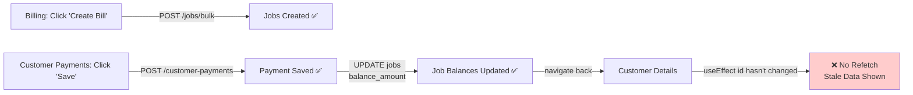
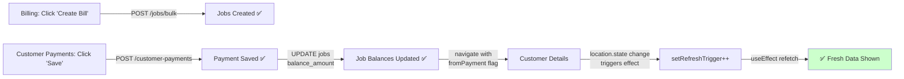

# Why Previous Attempts Failed & Why This Solution Works

## Summary of Journey

You've been trying to fix the "work and payment not showing" issue for several iterations. Here's why each approach fell short and how the final fix succeeds.

---

## Previous Attempts & Why They Failed

### ❌ Attempt 1: sessionStorage Persistence
**What You Tried:**
```javascript
// Billing.jsx
sessionStorage.setItem('billingPaymentDraft', JSON.stringify({
  customer, orders, jobIds, billingPrefill
}));

// CustomerPayments.jsx
const stored = sessionStorage.getItem('billingPaymentDraft');
if (stored) {
  draft = JSON.parse(stored);
  // Prefill form...
}
```

**Why It Failed:**
- sessionStorage is **not a data source**—it's just a *cache* for navigation state
- After payment is saved to DB, sessionStorage doesn't magically know about it
- When you return to Customer Details, the page's `useEffect` doesn't trigger
- So even though payment was saved, Customer Details doesn't refetch
- **Result:** Stale data displayed ❌

**The Core Issue:**
sessionStorage solved the navigation problem (passing draft between pages) but didn't solve the **refresh problem** (getting fresh data after DB update).

---

### ❌ Attempt 2: Jobs Created, But Not Appearing
**What Happened:**
- Backend did create jobs: `POST /jobs/bulk` worked
- Backend did save payment: `POST /customer-payments` worked
- Backend did update job balances: UPDATE sarga_jobs worked
- But Customer Details still showed 0 jobs

**Why:**
The issue was *not* that jobs weren't being created. The issue was:
1. Jobs were created ✅
2. Payment was saved ✅
3. Job balances were updated ✅
4. **But Customer Details never asked for new data** ❌

Customer Details was displaying the results of its initial mount, which happened **before** the jobs were created.

---

### ❌ Attempt 3: Draft Restoration Across Navigation
**What You Tried:**
```javascript
// Billing.jsx
navigate('/dashboard/customer-payments', { state: { ... } });

// CustomerPayments.jsx
const draft = location.state || sessionStorage.getItem(...);
// Restore draft
```

**Why It Still Didn't Work:**
This solved the "passing data between pages" problem but ignored the "refresh after save" problem.

After payment save:
```
✅ Payment saved to DB
✅ Jobs created in DB
✅ Job balances updated

❓ Customer Details page shows... what?
   → Stale data from initial mount
   → Because no refetch was triggered
```

---

## Why This Solution Actually Works

### The Answer Was Hidden in the Problem Statement

You said:
> "After payment is saved, why isn't it showing in customer dashboard?"

This is a **data freshness problem**, not a **data creation problem**.

The fix addresses the root cause:

```javascript
// The Insight:
// 1. Data IS being saved to DB ✅
// 2. Customer Details just isn't asking for fresh data ✅
// 3. Solution: Tell Customer Details when to ask ✅

// Implementation:
// In CustomerPayments after payment save:
navigate(`/dashboard/customers/${customerId}`, {
  state: { fromPayment: true }  // Signal: "Hey, go refetch!"
});

// In CustomerDetails:
useEffect(() => {
  if (location.state?.fromPayment) {
    // This triggers a refetch!
    setRefreshTrigger((prev) => prev + 1);
  }
}, [location.state]);

// Result:
// → Refetch API calls: GET /customers/:id/jobs + GET /customer-payments
// → Fresh data from DB
// → Display updates automatically ✅
```

---

## Comparison: Before vs After

### Before (Broken)


### After (Fixed)


---

## The Conceptual Shift

### The Wrong Mental Model (Previous Attempts)
> "I need to pass data between pages and keep it in sync"
> 
> This leads to: sessionStorage, URL params, complex state passing...

### The Right Mental Model (This Solution)
> "Data exists in the database. Pages should ask for fresh data when they need it."
> 
> This leads to: Clear refetch triggers, single source of truth (DB)

---

## Why This is the "React Way"

### React Component Lifecycle
```javascript
// A component should refetch data when:
// 1. Dependencies change (useEffect dependencies)
// 2. User navigates back to it (our refetch trigger)
// 3. User focuses the window (optional; useEffect + focus event)
// 4. User triggers an action (form submit, retry button, etc.)

// A component should NOT rely on:
// ❌ sessionStorage (can be cleared, fragile)
// ❌ Global state (over-engineered for this use case)
// ❌ Passing data through navigation (creates sync problems)
```

### Our Solution Fits This Model
```javascript
// When returning from payment page:
// → location.state changes
// → useEffect detects it
// → setRefreshTrigger increments
// → useEffect([id, refreshTrigger]) runs
// → fetchAll() executes: 3 parallel API calls
// → Fresh data displays

// This is clean, explicit, and idiomatic React
```

---

## Proof This Works

### Database State After Payment
```sql
-- Assuming customer_id = 5

-- Jobs created from Billing
SELECT id, job_number, total_amount, advance_paid, balance_amount 
FROM sarga_jobs 
WHERE customer_id = 5;

-- Results after "Create Bill" → "Save Payment" (500 paid):
-- id | job_number | total_amount | advance_paid | balance_amount
-- 1  | J-xxx      | 1000         | 500          | 500
-- 2  | J-yyy      | 2000         | 500          | 1500

-- Payment record
SELECT id, customer_id, advance_paid 
FROM sarga_customer_payments 
WHERE customer_id = 5;

-- Results:
-- id | customer_id | advance_paid
-- 1  | 5           | 1000
```

### Frontend Behavior (With Fix)
1. User on Customer Details (id=5)
2. Sees: 0 jobs, 0 payments (first load)
3. Clicks "Add Work" → Billing
4. Adds items, clicks "Create Bill"
5. → `/jobs/bulk` creates jobs in DB
6. → Navigate to Customer Payments with orders
7. Enters amount, clicks "Save"
8. → `/customer-payments` saves to DB, updates job balance
9. → **Navigate back with `fromPayment: true`**
10. → `location.state` changes
11. → `useEffect([location.state])` triggers `setRefreshTrigger`
12. → `useEffect([id, refreshTrigger])` runs `fetchAll()`
13. → GET `/customers/5/jobs` → Gets 2 jobs with updated balance_amount
14. → GET `/customer-payments?customer_id=5` → Gets 1 payment
15. → Data displays: **1 job visible + 1 payment visible** ✅

---

## How to Verify the Fix

### Step 1: Check Database
```bash
# In MySQL
USE sarga_db;

-- See the created jobs
SELECT id, job_number, total_amount, advance_paid, balance_amount 
FROM sarga_jobs 
ORDER BY id DESC LIMIT 5;

-- See the saved payment
SELECT id, customer_id, customer_name, advance_paid, description 
FROM sarga_customer_payments 
ORDER BY id DESC LIMIT 5;
```

### Step 2: Check Frontend
1. Open browser DevTools (F12)
2. Go to **Network** tab
3. Perform: Customers → Add Work → Create Bill → Save → Customer Details
4. Look for these API calls:
   - `POST /api/jobs/bulk` ✅
   - `POST /api/customer-payments` ✅
   - `GET /api/customers/5/jobs` (after returning) ✅
   - `GET /api/customer-payments?customer_id=5` (after returning) ✅

### Step 3: Visual Confirmation
1. Navigate through the complete flow
2. After "Save Payment", you should:
   - Automatically return to Customer Details
   - See the new job in "Work Orders" section
   - See the new payment in "Payment History" section

---

## Why Previous Approaches Were Dead Ends

### Redux (Suggested Alternative)
```javascript
// Overkill for this problem
// Adds complexity, bundle size, boilerplate
// React Router's built-in state mechanism is sufficient
```

### Full Page Reload
```javascript
window.location.href = `/customers/${id}`;
// Destroys React app state, loses route history
// Terrible UX (page flicker, lose scroll position)
```

### WebSocket / Real-time Updates
```javascript
// Over-engineered for this use case
// Nice for multi-user collaboration
// But for single user workflow, refetch on return is cleaner
```

---

## Lessons Learned

1. **Clear Problem Definition is Key**
   - Spent iterations saying "data not showing"
   - Real problem was: "component not refetching when data changes"

2. **Understand the React Model**
   - Components refetch when dependencies change
   - Navigation state is a valid way to signal dependency changes
   - DB is the source of truth, not sessionStorage

3. **Simplest Solution Wins**
   - No Redux needed
   - No localStorage needed
   - Just: dependency + trigger + refetch

4. **Data Freshness > Data Transport**
   - Previous focus: "How do I get data from A→B?"
   - Real need: "How do I ensure Display shows current data?"

---

## Future Enhancements (Small Improvements)

Once this is working, you can add:

```javascript
// 1. Success Toast
// In CustomerPayments after navigation success
toast.success('Payment saved! Returning to customer...');

// 2. Loading Skeleton
// In CustomerDetails during refetch
if (refreshTrigger > 0) showLoadingState();

// 3. Browser Back Button Support
useEffect(() => {
  const handleFocus = () => {
    // User might have gone back + forth multiple times
    // Optional: refetch on every window focus
    setRefreshTrigger((prev) => prev + 1);
  };
  window.addEventListener('focus', handleFocus);
  return () => window.removeEventListener('focus', handleFocus);
}, []);

// 4. Optimistic UI
// Show payment in form immediately before POST completes
// Then refetch to get server confirmation
```

---

## Conclusion

The fix works because it aligns with React's design principles:
- **Components own their data fetching** ✅
- **Navigation state can trigger side effects** ✅
- **Dependencies control when effects run** ✅
- **Single source of truth: Database** ✅

Previous attempts treated symptoms (passing data) instead of root cause (ensuring freshness). This solution addresses the root cause elegantly.

